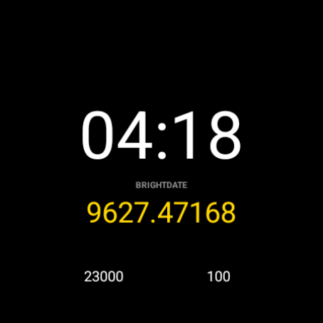

# BrightDate Watch Face

A Wear OS watch face that displays the current time alongside a live **[BrightDate](https://brightdate.org)** value — the universal decimal time anchored at J2000.0.



---

## What it shows

| Element | Description |
|---------|-------------|
| **Time** | 12/24-hour clock, synced to device setting |
| **BRIGHTDATE** | Days elapsed since J2000.0, computed on a TAI substrate (5 decimal places, ~1-minute resolution) |
| **Bottom-left complication** | Step count by default (user-configurable) |
| **Bottom-right complication** | Watch battery by default (user-configurable) |

### BrightDate formula

The watch face computes the BrightDate value in pure XML using Watch Face Format's `[MINUTES_SINCE_EPOCH]` variable:

```
BD = [MINUTES_SINCE_EPOCH] / 1440.0 − 10957.49919926
```

This bakes in the current TAI–UTC offset of **37 seconds** (in place since 2017-01-01). If IERS ever inserts another leap second, a point release will update the constant.

---

## Color themes

Seven built-in themes, selectable in the watch face editor:

| Theme | Accent color |
|-------|-------------|
| Gold *(default)* | `#FFD700` |
| Mint | `#7FFFD4` |
| Sky | `#8ECAE6` |
| Rose | `#FF9AB5` |
| Lilac | `#C9A0FF` |
| Amber | `#FF9500` |
| Mono | White |

---

## Requirements

- **Wear OS 5** or later (API level 35+)
- A Wear OS device or emulator

---

## Building

```bash
# Debug build
./gradlew assembleDebug

# Release bundle (requires keystore.properties)
./gradlew bundleRelease
```

### Signing

Create a `keystore.properties` file in the project root (it is gitignored):

```properties
storeFile=path/to/your.keystore
storePassword=...
keyAlias=...
keyPassword=...
```

---

## Project structure

```
app/src/main/
├── AndroidManifest.xml          # Watch Face Format v3, no-code app
└── res/
    ├── raw/watchface.xml        # All layout, colors, and BrightDate logic
    ├── xml/watch_face_info.xml  # Wear OS metadata
    └── values/strings.xml       # Localized labels and theme names
```

The entire watch face is declarative XML — no Kotlin/Java code.

---

## Related

- [BrightDate library (`@brightchain/brightdate`)](brightdate-README.md) — the TypeScript/JavaScript reference implementation
- [brightdate-rust](https://github.com/Digital-Defiance/brightdate-rust) — Rust port and CLI utilities
- [BrightChain](https://github.brightchain.org)

---

## License

See [LICENSE](LICENSE).
